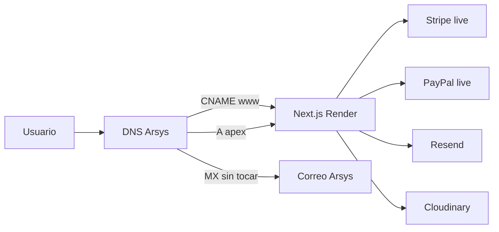

# Migración Opción A - Dominio Arsys + App en Render

Guía para pasar de la web CM4all actual (`www.gautex.com`) a la nueva web Next.js en Render.

**Estado actual:** preparación en repo completada. El go-live oficial (DNS, pagos live) se ejecuta **solo cuando confirmes que la web está entera**.

---

## Arquitectura



| Componente | Dónde vive |
|------------|------------|
| Dominio `gautex.com` | Arsys |
| Correo `@gautex.com` | Arsys (registros MX - no tocar) |
| Web Next.js | Render (`gautex-web`) |
| Dominio canónico | `https://www.gautex.com` |

---

## Fase 0 - Mientras se termina la web (ahora)

La web pública sigue en **CM4all**. La nueva se prueba en:

- Producción Render: https://gautex-web.onrender.com
- Staging: https://gautex-web-staging.onrender.com

### Checklist interno antes de pedir go-live

- [ ] Todas las páginas ES/EN completas
- [ ] Catálogo y precios correctos en `content/products.json`
- [ ] Checkout test (Stripe tarjeta `4242 4242 4242 4242`)
- [ ] Formularios contacto y presupuesto
- [ ] Configurador de campañas + subida de archivos
- [ ] Móvil y desktop
- [ ] Redirects legacy probados en `*.onrender.com`

### Redirects SEO ya preparados

Definidos en `src/lib/redirects.ts`, incluyen rutas CM4all `/ES/*`, `/EN/*` y variantes en minúsculas (`/ES/inicio/`).

---

## Fase 1 - Servicios externos (día D, antes del DNS)

Configurar **antes** del corte DNS. No activar claves live hasta estar listos.

### 1.1 Correo (SMTP Arsys en producción)

**Producción** usa SMTP Arsys (`info@gautex.com`). Requiere plan **Starter** en Render ($7/mes) - el plan free bloquea puertos SMTP.

**Staging** envía notificaciones a `gautexmedica@gmail.com` (Resend en plan free).

1. Contraseña SMTP en panel Arsys para `info@gautex.com`
2. Variables en Render (`gautex-web`):

| Variable | Valor |
|----------|-------|
| `EMAIL_TRANSPORT` | `smtp` |
| `SMTP_HOST` | `smtp.serviciodecorreo.es` |
| `SMTP_PORT` | `465` |
| `SMTP_USER` | `info@gautex.com` |
| `SMTP_PASS` | contraseña Arsys |
| `SMTP_FROM` | `Gautex Medica <info@gautex.com>` |
| `CONTACT_EMAIL` | `info@gautex.com` |

3. Staging (`gautex-web-staging`):

| Variable | Valor |
|----------|-------|
| `CONTACT_EMAIL` | `gautexmedica@gmail.com` |
| `EMAIL_TRANSPORT` | `resend` |
| `RESEND_API_KEY` | `re_…` (misma cuenta Resend) |

**Script rápido:**

```powershell
$env:RENDER_API_KEY = "rnd_..."
.\scripts\setup-email-arsys-render.ps1 -SmtpPass "..."
```

Resend (opcional): si prefieres API en lugar de SMTP, verifica dominio en https://resend.com y usa `EMAIL_TRANSPORT=resend`.

### 1.2 Cloudinary (uploads campañas)

1. Cuenta en https://cloudinary.com
2. Crear upload preset **unsigned**, carpeta `gautex/campaigns`
3. Variables en Render:

| Variable | Valor |
|----------|-------|
| `CLOUDINARY_CLOUD_NAME` | tu cloud name |
| `CLOUDINARY_UPLOAD_PRESET` | nombre del preset |

### 1.3 Stripe LIVE

1. https://dashboard.stripe.com/apikeys → claves **live**
2. Webhook en modo live:
   - URL: `https://www.gautex.com/api/stripe/webhook`
   - Evento: `checkout.session.completed`
   - Secret → `STRIPE_WEBHOOK_SECRET`
3. Variables: `STRIPE_SECRET_KEY`, `NEXT_PUBLIC_STRIPE_PUBLISHABLE_KEY`, `STRIPE_WEBHOOK_SECRET`

### 1.4 PayPal LIVE

1. https://developer.paypal.com/dashboard/applications/live
2. Variables: `PAYPAL_CLIENT_ID`, `PAYPAL_CLIENT_SECRET`, `PAYPAL_MODE=live`

### 1.5 Google Analytics 4

**ID configurado:** `G-V86Q4399E2` (flujo web para `https://www.gautex.com`).

Mientras `www.gautex.com` siga siendo la web antigua (CM4all), las analíticas funcionan en Render:

| Entorno | URL para probar | GA4 debug |
|---------|-----------------|-----------|
| Staging | https://gautex-web-staging.onrender.com | Sí (`NEXT_PUBLIC_GA_DEBUG=true`) |
| Producción Render | https://gautex-web.onrender.com | No |
| Go-live DNS | https://www.gautex.com | No |

**Probar ahora (staging):**

1. Aceptar cookies en el banner
2. Navegar por `/productos`, `/contacto`, etc.
3. GA4 → **Informes en tiempo real** → filtrar por hostname `gautex-web-staging.onrender.com`

**Variables en Render** (ya en `render.yaml`):

- `NEXT_PUBLIC_GA_ID=G-V86Q4399E2`
- `NEXT_PUBLIC_GA_DEBUG=true` (solo staging)

**Script rápido** (si hace falta forzar env + redeploy):

```powershell
$env:RENDER_API_KEY = "rnd_..."
.\scripts\setup-ga-render.ps1
```

En el go-live, el mismo ID recibirá tráfico de `www.gautex.com` sin cambios de código.

### Script rápido

```powershell
$env:RENDER_API_KEY = "rnd_..."
.\scripts\setup-go-live-render.ps1 `
  -PaypalClientId "..." -PaypalClientSecret "..." `
  -StripeSecretKey "sk_live_..." -StripePublishableKey "pk_live_..." `
  -StripeWebhookSecret "whsec_..." `
  -ResendApiKey "re_..." `
  -CloudinaryCloudName "..." -CloudinaryUploadPreset "..." `
  -GaId "G-XXXXXXXXXX"
```

---

## Fase 2 - Dominio en Render

En https://dashboard.render.com → `gautex-web` → **Settings → Custom Domains**:

1. Añadir `www.gautex.com` (primario)
2. Añadir `gautex.com` → **Redirect to www**
3. Esperar certificado SSL (verde)
4. Anotar registros DNS exactos que muestre Render

Confirmar en Render:

- `NEXT_PUBLIC_SITE_URL` = `https://www.gautex.com` (ya en `render.yaml`)

---

## Fase 3 - DNS en Arsys (corte)

En https://secure.arsys.es → Dominio `gautex.com` → **Zona DNS**

### Cambiar (web)

| Tipo | Nombre | Valor |
|------|--------|-------|
| CNAME | `www` | `gautex-web.onrender.com` |
| A o ALIAS | `@` | IP/registro que indique Render |

Eliminar registros A de `www` que apunten a `217.76.142.87` (CM4all).

### No tocar (correo)

- Registros **MX** de `@`
- SPF/DKIM del correo Arsys existente

### Pre-corte

1. Bajar TTL a **300–600 s** unos días antes
2. Hacer el cambio en horario de bajo tráfico

---

## Fase 4 - Secuencia día D

| Momento | Acción |
|---------|--------|
| T-48h | TTL bajo en Arsys |
| T-24h | `setup-go-live-render.ps1` + pruebas en `*.onrender.com` |
| T-2h | Dominios verificados en Render + SSL activo |
| T-1h | Webhook Stripe **live** creado |
| **T-0** | Cambio DNS en Arsys |
| T+15min | `node scripts/verify-migration.mjs` |
| T+30min | Pruebas manuales + pago real mínimo |
| T+24h | Google Search Console: enviar `sitemap.xml` |
| T+2 sem | Dar de baja hosting CM4all en Arsys (opcional) |

---

## Verificación post-corte

### Automática

```bash
node scripts/verify-migration.mjs
# o contra otro host:
node scripts/verify-migration.mjs --base https://www.gautex.com
```

### Manual

- [ ] `https://www.gautex.com` responde con Next.js (no `CM4all Webserver`)
- [ ] `https://gautex.com` redirige a `www`
- [ ] Correo `info@gautex.com` sigue recibiendo
- [ ] `/ES/Contacto/` → `/contacto` (301)
- [ ] `/ES/Productos/Viva-Condoms/` → producto correcto
- [ ] Checkout Stripe live + email confirmación
- [ ] PayPal live
- [ ] Formulario contacto envía vía SMTP Arsys
- [ ] Upload en configurador campañas (Cloudinary)
- [ ] `https://www.gautex.com/sitemap.xml` accesible

---

## Riesgos y mitigaciones

| Riesgo | Mitigación |
|--------|------------|
| Cold start Render free (~30s) | Plan de pago ($7/mes) antes del go-live |
| Formularios 403 en apex | Middleware redirige apex→www; api-guard acepta ambos orígenes |
| Emails no enviados | SMTP en Render Starter o Resend + verificación dominio |
| Upload campañas falla | Cloudinary obligatorio en producción |
| SEO | Redirects 301 + sitemap + Search Console |
| Correo roto | No modificar MX al cambiar DNS web |

---

## Cómo activar el go-live

Cuando la web esté **completa y revisada**, avisa con:

> *"La web está lista, hagamos el corte"*

Entonces ejecutar Fases 1–4 de este documento en orden.
